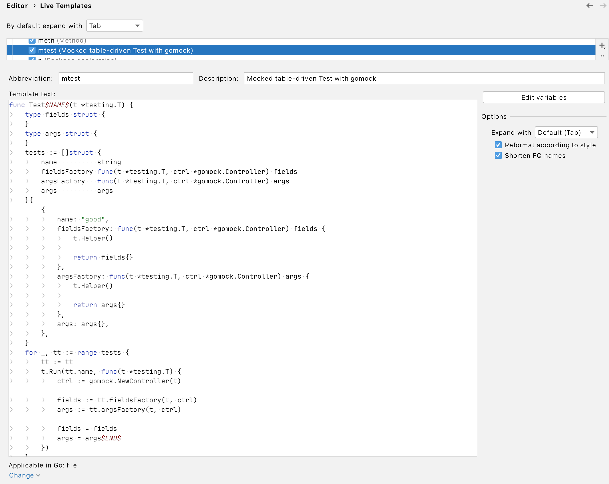
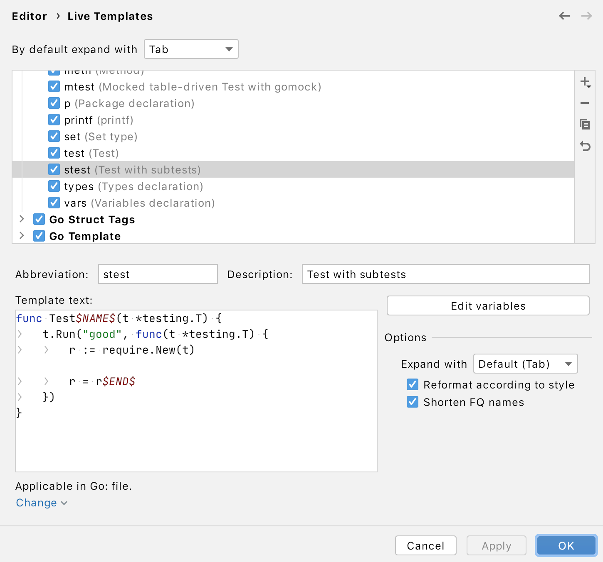

# go-table-testing-arg-functions

Example on how to use fields/args generators in table-tests.

# Generic Pattern to build table-driven tests with args/field "factories":

## 1. 💡 Generate test stub 

Generate table-driven test stub first, like this:
```go
// Typical autogenerated code for table-tests, nothing special here:
func TestProductsForUser_Get(t *testing.T) {
    type fields struct {
        userSvc    UserService
        productSvc ProductService
    }
    type args struct {
        userID model.UserID
    }
    tests := []struct {
        name    string
        fields  fields
        args    args
        want    []model.Product
        wantErr bool
    }{
        // TODO: Add test cases.
    }
    for _, tt := range tests {
        tt := tt
        t.Run(tt.name, func(t *testing.T) {
            pu := &ProductsForUser{
                userSvc:    tt.fields.userSvc,
                productSvc: tt.fields.productSvc,
            }
            got, err := pu.Get(tt.args.userID)
            if (err != nil) != tt.wantErr {
                t.Errorf("Get() error = %v, wantErr %v", err, tt.wantErr)
                return
            }
            if !reflect.DeepEqual(got, tt.want) {
                t.Errorf("Get() got = %v, want %v", got, tt.want)
            }
        })
    }
}
```

**NOTE:** And do not forget about assignments `tt := tt` in case those will be converted to parallel tests in the future (using `t.Parallel()`):
```go
    for _, tt := range tests {
        tt := tt // <-- THIS IS IMPORTANT
        t.Run(tt.name, func(t *testing.T) {
            t.Parallel()
            // write actual test			
        })
    }

```

----

## 2. ⚙️ Refactor code 

Change the `args` and/or `fields` parameter to be a function that returns filled `args`/`fields` respectively:
```go
    type fields struct {
        userSvc    UserService
        productSvc ProductService
    }
    type args struct {
        userID model.UserID
    }
    tests := []struct {
        name       string
        fieldsFunc func(t *testing.T, ctrl *gomock.Controller) fields // <-- THIS IS a "factory"
        args       args // <-- In some cases, this also can be converted to a "factory" 
        want       []model.Product
        wantErr    bool
    }{
        // TODO: Add test cases.
    }
```

Typical "factory" function signature may look like:
```go
func(t *testing.T) fields
```
or in case of [GoMock](https://github.com/golang/mock)
```go
func(t *testing.T, ctrl *gomock.Controller) fields
```

----

## 3. 🎯 Benefits 

The benefits of using this "factory" approach to prepare all the fields inside `args`/`fields` are:

- the ability to code custom preparation logic;
- the ability to build one mock/stub that is dependent on another one, i.e., introduce coupling between components;

As shown in the example:
```go
fieldsFunc: func(t *testing.T, ctrl *gomock.Controller) fields {
    t.Helper()

    userSvc := mock_usecases.NewMockUserService(ctrl)
    userSvc.EXPECT().Get(gomock.Any()).Return(model.User{
        ID:   "some-user-ID",
        Name: "name",
    }, nil).Times(1)
    productSvc := mock_usecases.NewMockProductService(ctrl)
    productSvc.EXPECT().GetProducts(gomock.Any()).Return(nil, errors.New("get products")).Times(1)
    return fields{
        userSvc:    userSvc,
        productSvc: productSvc,
    }
}
```

**NOTE:** Do not forget to use `t.Helper()` function in the beginning of the "factory".

----

## 4. 🕶️ Useful IntelliJ Live Templates

### 📖 mtest

**Description:** Mocked table-driven Test with gomock

**Note:** assumed testing library: [GoMock](https://github.com/golang/mock)



```go
func Test$NAME$(t *testing.T) {
	type fields struct {
	}
	type args struct {
	}
	tests := []struct {
		name          string
		fieldsFactory func(t *testing.T, ctrl *gomock.Controller) fields
		argsFactory   func(t *testing.T, ctrl *gomock.Controller) args
		args          args
	}{
        {
			name: "good",
			fieldsFactory: func(t *testing.T, ctrl *gomock.Controller) fields {
				t.Helper()
				
				return fields{}
			},
			argsFactory: func(t *testing.T, ctrl *gomock.Controller) args {
				t.Helper()
				
				return args{}
			},
			args: args{},
		},
	}
	for _, tt := range tests {
		tt := tt
		t.Run(tt.name, func(t *testing.T) {
			ctrl := gomock.NewController(t)

			fields := tt.fieldsFactory(t, ctrl)
			args := tt.argsFactory(t, ctrl)

			fields = fields
			args = args$END$
		})
	}
}
```

### 📖 stest

**Description:** Test with subtests

**Note:** assumed testing library: [Testify](https://github.com/stretchr/testify)



```go
func Test$NAME$(t *testing.T) {
    t.Run("good", func(t *testing.T) {
        r := require.New(t)

        r = r$END$
    })
}
```

### 📖 erris

**Description:** If error IS()

```go
if errors.Is($ERR$, $TARTGET_ERR$) {
    $END$
}
```

### 📖 erras

**Description:** If error AS()

```go
var $TARTGET_ERR$ *$TARGET_ERR_TYPE$
if errors.Is($ERR$, &$TARTGET_ERR$) {
    $END$
}
```

### 📖 set

**Description:** Set type

```go
map[$KEY_TYPE$]struct{}
```